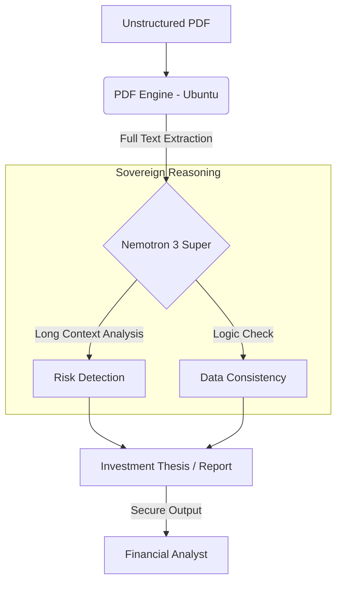

# 📈 Sovereign Financial Intelligence Analyst

This AI Agent is a **Senior Hedge Fund Analyst** designed to perform deep reasoning over massive corporate financial reports (10-K, 10-Q, Annual Reports). Powered by **NVIDIA Nemotron 3 Super (120B)**, it overcomes the limitations of traditional RAG (Retrieval-Augmented Generation) by processing entire documents within a single context window.

---

## 💎 The Innovation: Million Token Context

Most AI financial tools "chunk" documents into small pieces, losing the narrative flow and cross-sectional consistency. This agent leverages Nemotron's **1,000,000 token context window** to:

1. **Detect Contradictions:** Compare statements made on page 5 with data tables on page 150.
2. **Sentiment Analysis:** Identify subtle shifts in executive confidence across the entire report.
3. **Hidden Risk Extraction:** Surface "fine print" warnings that traditional keyword searches miss.

---

## 📐 System Architecture


## 🚀 Key Features
- **Zero-Chunking Architecture:** Analyzes the full document structure for holistic understanding.
- **Privacy First:** Designed for sovereign deployment on private infrastructure (NVIDIA NIM), ensuring financial data never leaves the secure environment.
- **Hedge Fund Grade Logic:** Specialized prompts for detecting "window dressing" and accounting anomalies.
- **Streamlit Interface:** Clean, professional dashboard for document uploading and real-time reasoning.

## 🛠️ Tech Stack
- **Model:** NVIDIA Nemotron 3 Super (120B) via NVIDIA Build API.
- **Frontend:** Streamlit.
- **PDF Processing:** `pypdf` (Optimized for financial tables).
- **Cloud:** Hugging Face Spaces (Sovereign Configuration).

## 💻 Installation
Clone the repository:

```Bash
git clone [https://github.com/oscartm/sovereign-financial-analyst.git](https://github.com/oscartm/sovereign-financial-analyst.git)
cd sovereign-financial-analyst
```
Install dependencies:

Bash
pip install -r requirements.txt
Set your Secrets:
Add your NVIDIA_API_KEY to your environment variables or Hugging Face Secrets.

Run:

Bash
streamlit run app.py
📋 Example Use Case
Input: A 200-page quarterly earnings report.
Reasoning: The agent identifies that the CEO's optimistic tone regarding "future growth" (Page 2) is statistically inconsistent with the "increased debt service" mentioned in the footnotes (Page 184).
Result: A "High Caution" rating with specific page references for the human analyst to review.

📄 License
MIT License. Inspired by the sovereign AI methodology championed by the NVIDIA developer community.
